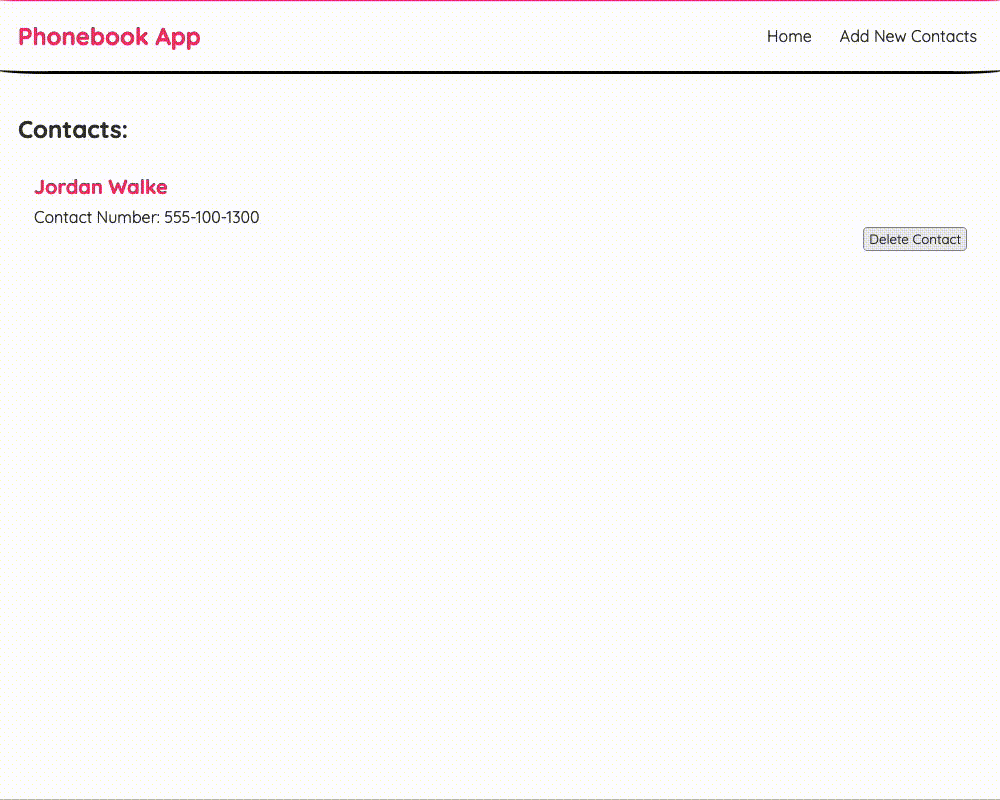
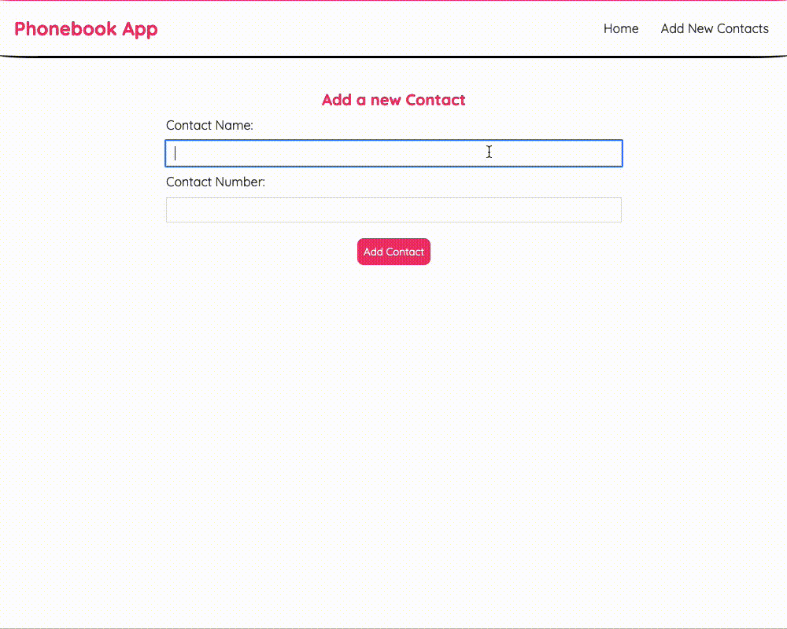
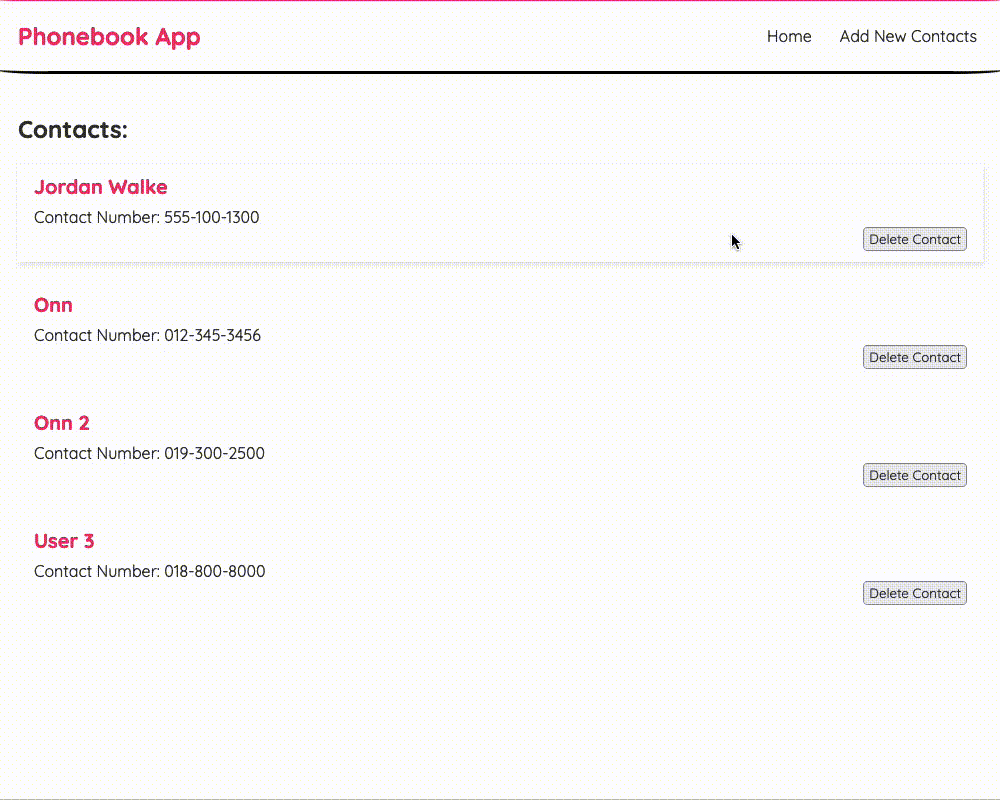

## Examples 
<h2>Navigation Menu</h2>
  
<br>
<h2>Adding Contact</h2>
  
<br>
<h2>Deleting Contact</h2>
  
<br>

### Setup

In a terminal :
```bash

# Clone the repository
$ git clone https://github.com/LanCheeOnn/phone-book
$ cd phone-boom

# Install the dependencies
$ npm install

# Launch the development server
$ yarn start
```

## Available Scripts

In the project directory, you can run:

### `yarn start`

Runs the app in the development mode.\
Open [http://localhost:3000](http://localhost:3000) to view it in the browser.

The page will reload if you make edits.\
You will also see any lint errors in the console.

## `npx json-server --watch data/db.json --port 8000`

Watches the db.json file for the backend to work.